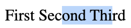
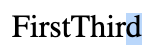

# How to change selection.setBaseAndExtent to use Flat Tree Traversal

If we use flat tree traversal in `Range.setStart/setEnd`, to keep it consistent, we would need to change `Selection.setBaseAndExtent` to also use a flat tree traversal. But that would be breaking the existing API.

I propose adding new API that explicitly uses flat tree traversal:

- Selection.setBaseAndExtentVisual(anchorNode, anchorOffset, focusNode, focusOffset)
- Range.setStartVisual(startNode, startOffset)
- Range.setEndVisual(endNode, endOffset)

Alternatively, we can change these APIs to uses a boolean to decide which traversal to use:

- Selection.setBaseAndExtent(anchorNode, anchorOffset, focusNode, focusOffset, visual = false)
- Range.setStart(anchorNode, anchorOffset, focusNode, focusOffset, visual = false)
- Range.setEnd(anchorNode, anchorOffset, focusNode, focusOffset, visual = false)

These APIs will modify the same Selection/Range, but with different algrithmic steps.

## Example 1: Slotted to shadowed content

```HTML
<div id="container">
  <div id=host>Second</div>
</div>
```

```JS
const shadowRoot = host.attachShadow({ mode:"open" });
shadowRoot.innerHTML = 'First <slot></slot> Third';
const second = host.firstChild;
const third = shadowRoot.querySelector('slot').nextSibling;
const sel = getSelection();
sel.setBaseAndExtent(second, 3, third, 4);
```

In the existing API, we use DOM tree traversal.

1. `sel.setBaseAndExtent(second, 3, third, 4);`
2. In DOM order, `second` is after `third`.
3. Since `third` is before, we will call `setStart(third)`.
4. Since `second` is after, we will call`setEnd(second)`.
5. When we call `Selection.getComposedRanges({ shadowRoots: [shadowRoot] })`, we get start {third, 4} and end {second, 3}.

In flat tree traversal:

1. `sel.setBaseAndExtentVisual(second, 3, third, 4);`
2. In flat tree, `third` is after `second`.
3. Since `second` is before, we will call `setStartVisual(second)`.
4. Since `third` is after, we will call`setEndVisual(third)`.
5. When we call `Selection.getComposedRanges({ shadowRoots: [shadowRoot] })`, we get start {second, 3} and end {third, 4}.

Note, these present different visual selection across browsers:

1. Blink 
2. Webkit 
3. Gecko 

## Example 2: Slotted to slotted content

```HTML
<div id="container">
  <div id=host>
    <div id=div1 slot=slot2>slotted content 1</div>
    <div id=div2 slot=slot1>slotted content 2</div>
  </div>
</div>
```

```JS
const shadowRoot = host.attachShadow({mode: 'open'});
shadowRoot.innerHTML = [
  '<span>before</span>',
  '<slot name=slot1></slot>',
  '<span>between</span>',
  '<slot name=slot2></slot>',
  '<span>after</span>',
].join('');

const sel = getSelection();
sel.setBaseAndExtent(div1.firstChild, 2, div2.firstChild, 2);
```

In the existing API, we use DOM tree traversal.

1. `sel.setBaseAndExtent(div1.firstChild, 2, div2.firstChild, 2);`
2. In DOM order, `div1` is before `div2`.
3. Since `div1` is before, we will call `setStart(div1.firstChild)`.
4. Since `div2` is after, we will call`setEnd(div2.firstChild)`.
5. When we call `Selection.getComposedRanges({ shadowRoots: [shadowRoot] })`, we get start {div1.firstChild, 2} and end {div2.firstChild, 2}.

In the flat tree API.

1. `sel.setBaseAndExtent(div1.firstChild, 2, div2.firstChild, 2);`
2. In flat tree order, `div1` is after `div2`.
3. Since `div2` is before, we will call `setStart(div2.firstChild)`.
4. Since `div1` is after, we will call`setEnd(div1.firstChild)`.
5. When we call `Selection.getComposedRanges({ shadowRoots: [shadowRoot] })`, we get start {div2.firstChild, 2} and end {div1.firstChild, 2}.

Note, these present different visual selection across browsers:

1. Blink 
2. Webkit 
3. Gecko 

## Example 3: Unsolotted to shadowed content

```HTML
<div id="container">
  <div id=host>Second</div>
</div>
```

```JS
const shadowRoot = host.attachShadow({ mode:"open" });
shadowRoot.innerHTML = '<span id="first">First</span><span id=third>Third</span>';
const second = host.firstChild;
const third = shadowRoot.getElementById('third').firstChild;
const sel = getSelection();
sel.setBaseAndExtent(second, 3, third, 4);
```

In the existing API, we use DOM tree traversal.

1. `sel.setBaseAndExtent(second, 3, third, 4);`
2. In DOM order, `second` is after `third`.
3. Since `third` is before, we will call `setStart(third)`.
4. Since `second` is after, we will call`setEnd(second)`.
5. When we call `Selection.getComposedRanges({ shadowRoots: [shadowRoot] })`, we get start {third, 4} and end {second, 3}.

In the flat tree API.

1. `sel.setBaseAndExtentVisual(second, 3, third, 4);`
2. In flat tree, `second` does not exist (is not slotted).
3. Since `second` is not before, we will call `setStartVisual(third)`.
4. Since `third` is not after, we will call`setEndVisual(second)`.
5. When we call `Selection.getComposedRanges({ shadowRoots: [shadowRoot] })`, we get collapsed start and end both at {second, 3}.

Note, these present different visual selection across browsers:

1. Blink 
2. Webkit 
3. Gecko 
